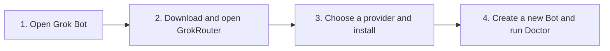

<p align="center">
  
</p>

<h1 align="center">GrokRouter</h1>

<p align="center">
  <strong>Bring your own model to Grok Bot.</strong><br>
  Route the official Grok Bot desktop app through the Codex SDK, OpenRouter, Anthropic, or xAI<br>
  without giving up its chat, Bots, files, computer, or tool boundary.
</p>

<p align="center">
  
  
  
  
</p>

> [!IMPORTANT]
> GrokRouter is an experimental, unofficial, reversible project for **Grok Bot 0.30.0 and 0.44.0 only**. If GrokRouter reports an unsupported or changed version, stop. Never force it past that check.

## What does it do?

You keep using the normal Grok Bot app. GrokRouter lets an individual Bot use the Codex SDK, any model on OpenRouter (including the free ones), a Claude subscription through the Claude Agent SDK, or a Grok subscription through xAI's own sign-in as its AI brain.

| You keep | You choose |
| --- | --- |
| Grok Bot's desktop app and chat | Codex SDK, OpenRouter, Anthropic, or xAI |
| Existing Bots and conversations | A different provider per Bot |
| Cloud computer, files, browser, and permissions | A different model and reasoning level per Bot |
| Grok's outer tool-execution boundary | Stock Grok again at any time |

It is reversible: **Restore Stock Grok Bot** puts the verified original inference path back.

## Start here: get it working on a Mac

> [!TIP]
> **Just want it working? Follow the four numbered steps below and stop. Everything after “Give this repository to your AI assistant” is optional technical detail.**



### Before you start: four yes-or-no checks

Continue only if every answer is **yes**:

- **Mac:** You have an Apple-silicon Mac—M1, M2, M3, M4, or newer—running macOS 12 or later.
- **Grok Bot:** The official **Grok Bot 0.30.0 or 0.44.0** app is inside your Mac's main `Applications` folder.
- **Bot computer:** You can select a Bot in Grok Bot and click **Open computer**.
- **Model access:** You have at least one of: a Codex account, an OpenRouter API key beginning with `sk-or-v1-` (free models exist, so a key with no credit still works), a Claude Pro/Max subscription, or a SuperGrok or X Premium+ subscription.

Windows builds exist for developers to inspect, but Windows is not yet the beginner installation path.

### 1. Open Grok Bot

Open the official Grok Bot app. Select any Bot, click **Open computer**, and leave Grok Bot open.

### 2. Install and open GrokRouter

The fastest path is one pinned command. Open your Mac's **Terminal**, paste this entire line, and press Return:

```bash
/usr/bin/curl --fail --silent --show-error --location https://raw.githubusercontent.com/promptadvisers/grokrouter/source-v0.1.0-beta.46/scripts/install-macos.sh --output /tmp/grokrouter-install.sh && /bin/bash /tmp/grokrouter-install.sh
```

It downloads the exact tagged source, builds GrokRouter locally, verifies it, installs it in your Applications folder, and opens it. It does not use `sudo`.

If you prefer not to paste a Terminal command, use the equivalent ZIP path:

1. Click the green **Code** button near the top of this GitHub page.
2. Click **Download ZIP**.
3. Open your Mac's **Downloads** folder and double-click the downloaded ZIP.
4. Open the new folder whose name starts with `grokrouter` (usually `grokrouter-main`).
5. Double-click **Install GrokRouter.command**. Keep the Terminal window open while it builds.

The process is finished when Terminal says:

```text
GrokRouter is installed in your Applications folder. Opening it now...
```

If macOS installs Apple Command Line Tools first, let that finish and then run the same Terminal command again—or double-click **Install GrokRouter.command** again if you used the ZIP path. If macOS asks whether to open the downloaded command, Control-click it, choose **Open**, and confirm **Open**. You never need to disable Gatekeeper or use `sudo`.

### 3. Choose your model and click Install Router

Pick the row that matches what you have:

| What you have | What to select |
| --- | --- |
| A Codex account | Keep **Codex SDK** checked. You can uncheck OpenRouter. Select **Codex SDK** as the default. |
| An OpenRouter key | Keep **OpenRouter** checked, paste the complete `sk-or-v1-...` key, and select **OpenRouter** as the default. |
| A Claude Pro or Max subscription | Keep **Anthropic** checked and select **Anthropic** as the default. Sign in after installation with **Start Anthropic Sign-in**. Usage draws on your plan's Agent SDK credit. |
| A SuperGrok or X Premium+ subscription | Keep **xAI** checked and select **xAI** as the default. Sign in after installation with **Start xAI Sign-in**. |
| Several | Keep each one checked, paste your OpenRouter key if you have one, and choose whichever provider you want new Bots to use first. |

Click **Install Router** and wait. Do not close Grok Bot or GrokRouter.

- If GrokRouter asks for a Bot computer, return to Grok Bot, select any Bot, and click **Open computer**.
- If you selected Codex, click **Start Codex Sign-in** after installation and complete the sign-in shown in the Bot terminal.
- If you selected Anthropic, click **Start Anthropic Sign-in**. The Claude Agent SDK's own sign-in runs in the Bot terminal; GrokRouter never sees or stores a claude.ai token.
- If you selected xAI, click **Start xAI Sign-in**, open the shown link on any device, and confirm the code. The refresh token stays inside the Bot computer with owner-only permissions.
- Your OpenRouter key is sent directly to Grok Bot's protected Secrets store and cleared from the installer field.

The installer has finished when its log shows a line beginning with `✓ Installed`.

### 4. Prove it works in a brand-new Bot

Create a **new Bot after installation**. Do not use an old Bot as the first test.

> [!IMPORTANT]
> Do not wait for `/provider` to appear in Grok Bot's slash-suggestion menu. That menu is only a shortcut and can be stale. Click the normal chat box, type the complete command `/provider` yourself, and press Return.

In the new Bot's normal chat box, type and send these one at a time:

```text
/router doctor
/provider
```

You are done when:

- Doctor starts with `Router ...: OK`.
- `/provider` names the provider and model you selected.
- A normal message in that same Bot receives a normal answer.

From now on, stay inside Grok Bot. You do not need to keep GrokRouter open.

## If something goes wrong

| What you see | What to do |
| --- | --- |
| `/provider` is missing from the slash menu | Type the complete `/provider` command manually and press Return. Then follow [the missing-command checklist](#provider-is-missing-from-the-slash-menu). |
| You installed from a fork, old clone, or old ZIP | Do not troubleshoot that copy. Run the pinned beta.46 command in [Step 2](#2-install-and-open-grokrouter) so the installer is built from the exact official tag. |
| You previously installed OpenGrok or another router | Do not install one router on top of another. First create a genuinely new Bot and manually run `/router doctor` and `/provider`; if both identify GrokRouter beta.46 and your selected model, stop because it is already working. Otherwise use GrokRouter's **Restore Stock Grok Bot** and continue only if it confirms a verified restore. Never force, hand-edit, or copy a cloud-host backup. |
| Apple Command Line Tools are required | Finish Apple's installation, then repeat whichever installation path you used. |
| macOS will not open the command | Control-click **Install GrokRouter.command**, choose **Open**, then confirm **Open**. Do not disable Gatekeeper. |
| `install Grok Bot 0.30.0 or 0.44.0 in Applications first` | Put the official app at `/Applications/Grok Bot.app`, open it once, then retry. |
| Unsupported or changed Grok Bot version | Stop. Do not force the installation or change the version/hash checks. |
| GrokRouter asks for a Bot computer | In Grok Bot, select any Bot and click **Open computer**. Leave it open while the installer continues. |
| `Action needed` appears | Follow the large instruction in GrokRouter. It continues automatically after the Bot computer is available. |
| Installation stopped while downloading dependencies | Confirm the Bot computer has internet access, then click **Try installation again**. |
| Installation stopped with another error | Click **Copy safe diagnostics** and paste the report into a GitHub issue. It excludes credentials, conversations, and Bot files. |
| You are testing the Windows x64 or Arm64 build | Windows is a source preview, not the supported beginner path. Do not use the Mac Terminal command. Report the exact CI artifact, last installer phase, prior-router history, and complete safe diagnostics. |
| Codex is not signed in | Open GrokRouter, click **Start Codex Sign-in**, and complete the displayed device flow. |
| Anthropic is not signed in, or Doctor says the Claude Agent SDK is missing | Make sure **Anthropic** was checked during installation, then click **Start Anthropic Sign-in**. |
| xAI says not signed in or sign-in expired | Click **Start xAI Sign-in** again. A 403 from xAI means that account's plan does not include agent access. |
| OpenRouter reports a credential problem | Paste the complete key beginning with `sk-or-v1-`, without spaces before or after it. |
| Step 5 says this Bot computer's host did not pass the stock-host checks | GrokRouter accepts a host either from the exact signed list or by structural verification (no router marker, every source anchor exactly once, a read-only patch that passes `node --check`, and a plausible size). If both fail, nothing is patched. If you previously installed OpenGrok or another router, use **Restore Stock Grok Bot** first. Otherwise click **Copy safe diagnostics** and open the support issue; the complete non-secret fingerprint and the reason are included. |
| The version says beta.46, but Doctor says `stock-or-unknown`, `no router marker`, or that the host adapter is not patched | The runtime and live host adapter are separate. **Do not update or install from inside Grok Bot.** Follow [the adapter-mismatch repair](#the-version-is-correct-but-the-host-adapter-is-not-patched). |
| Grok Bot answers a router command conversationally, opens its terminal, or offers to install/repair GrokRouter itself | Stop that attempt. The router did not intercept the command. Use the GrokRouter desktop app on the Mac to run Doctor and Repair Router. |
| `Model Router error [code]` appears in a Bot | The code names the cause and the message names the fix. For the full history, open that Bot's computer and run `grokbot-router errors`. `/router doctor` also lists the three most recent failures. |
| Anthropic sign-in says the installed Claude binary does not run | Reinstall with **Anthropic** checked. The installer now verifies the binary matches this Bot computer's platform and C library before recording it. |
| GrokRouter was working and then stopped | Open GrokRouter, click **Run Doctor**, then **Repair Router**. If you want to undo everything, click **Restore Stock Grok Bot**. |

If Doctor still reports a failure, copy its complete non-secret output into an [installation support issue](https://github.com/promptadvisers/grokrouter/issues/new?template=installation-failure.yml) or give it to your AI assistant. Never post an API key.

### The version is correct, but the host adapter is not patched

GrokRouter has two pieces that must agree:

1. **Runtime files** contain the provider code and display the GrokRouter version.
2. **The active host adapter** makes Grok Bot intercept commands such as `/provider` before an ordinary model sees them.

Seeing `0.1.0-beta.46` proves only the first piece. If Doctor reports `stock-or-unknown`, `no router marker`, or `host adapter is not patched`, the runtime exists but the Grok host currently running is stock or was replaced. This is an adapter mismatch—not a request to download a newer version.

Repair it in this exact order:

1. **Stop any installation started by a Grok conversation.** Do not let Grok Bot install, update, patch, or troubleshoot GrokRouter from its own chat or terminal.
2. On the **Mac**, open `/Applications/Grok Bot.app` and the **GrokRouter desktop app**.
3. In Grok Bot, select any Bot, click **Open computer**, and leave that computer visible.
4. In GrokRouter, click **Run Doctor**. If it reports the adapter mismatch on the supported Grok Bot 0.30.0 build, click **Repair Router**.
5. Wait for GrokRouter to say `Router repaired. Automatic repair is enabled.` Do not close either app while it is working.
6. After GrokRouter finishes, fully quit and reopen Grok Bot. Create a genuinely new Bot.
7. Manually type `/router doctor`, then `/provider`, into the new Bot's normal message box.

The repair passes only when `/router doctor` begins with `Router 0.1.0-beta.46: OK` and `/provider` immediately names the selected provider and model. If Grok replies in normal prose, opens a terminal, or offers to repair anything, interception still failed; return to the Mac GrokRouter app and copy **safe diagnostics**.

### A new stock host variant is not an endless reinstall

Grok serves many slightly different Bot-computer host builds behind the same Grok Bot 0.30.0 Mac app. Every early install report in this repository was the same failure: a genuine stock host whose exact hash was not yet on the list. GrokRouter now accepts a host in two ways, and tells you which one it used:

1. **Exact signed list.** The hash and byte count match the bundled manifest or the Ed25519-signed public compatibility registry. This is the historical path and still runs first.
2. **Structural verification.** The host carries no GrokRouter, legacy, or other-router marker; every required source anchor appears exactly once; a read-only copy of the patch passes `node --check`; and the file size is within the expected band for 0.30.0 hosts. The untouched host is backed up before anything is patched, so **Restore Stock Grok Bot** returns exactly what was running.

If both checks fail, nothing is patched. The installer creates a complete safe report containing two SHA halves, byte count, cloud architecture, anchor counts, the read-only patch result, the trust tier, and the reason it stopped. Click **Copy safe diagnostics** and submit that report. Do not paste Grok's proprietary host source into GitHub.

To go back to the strict exact-hash-only behavior, set `anchorVerifiedHosts.enabled` to `false` in `patch/manifests/0.30.0.json` before building.

### `/provider` is missing from the slash menu

This is the most common setup misunderstanding. **The slash menu is not the test.** GrokRouter handles the literal command before model inference, so `/provider` can work even when Grok Bot has not refreshed its suggestion menu.

Follow these steps in order. Stop as soon as a step passes.

1. **Type it manually.** Click the Bot's normal message box, type exactly `/provider`, and press Return. Do not select a suggestion and do not ask the Bot in natural language.
2. **Read the result.** If the reply names `Codex SDK` or `OpenRouter` and a model, routing works. You can keep typing the commands manually; the missing suggestion is only a discovery-menu problem.
3. **Identify ordinary Grok behavior.** If Grok answers in normal prose, opens a terminal, or offers to install or repair the router, the command was not intercepted. Stop that attempt and follow [the adapter-mismatch repair](#the-version-is-correct-but-the-host-adapter-is-not-patched).
4. **Make sure the test Bot is new.** Create a genuinely new Bot **after** the latest installation, then manually send `/router doctor` followed by `/provider`.
5. **Replace stale source.** If you installed from a fork, old clone, bookmark, or previously downloaded ZIP, use the pinned beta.46 Terminal command from [Step 2](#2-install-and-open-grokrouter). It downloads the exact official tag into a new temporary folder; it does not depend on your old checkout.
6. **Reinstall with the Bot computer visible.** Open Grok Bot 0.30.0, select any Bot, click **Open computer**, and leave it open. Open GrokRouter, choose the provider, and click **Install Router**. Follow any large **Action needed** instruction. Do not close either app.
7. **Wait for both receipts.** The activity log must show a line beginning with `✓ Installed`. It should also say that it verified six unique GrokRouter commands. A spinning indicator, an ordinary Grok reply, or a missing slash suggestion is not an installation receipt.
8. **Retry the supported way.** If installation stops, use **Try installation again**. If Doctor reports a damaged or replaced host, use **Repair Router**, wait for success, and repeat the new-Bot test.
9. **Check for a command-name conflict.** GrokRouter does not overwrite a user-created skill with the same name. If Doctor reports a conflict for `provider`, `models`, `model`, `reasoning`, `router`, or `doctor`, rename or remove only that conflicting user-created skill, reinstall, and test again. Never delete Grok Bot files by hand.
10. **Collect safe evidence.** Click **Copy safe diagnostics** and save the complete report. It excludes credentials, conversations, and private Bot files. Never paste an API key, Codex device code, password, conversation, or private file into an issue or AI chat.

After a repair or reinstall, fully quit and reopen Grok Bot only after GrokRouter finishes. Create another new Bot and manually run:

```text
/router doctor
/provider
/models
```

The setup passes when Doctor begins with `Router 0.1.0-beta.46: OK`, `/provider` names the selected provider and model, `/models` returns the packaged list, and a normal message receives one normal response.

## Everyday commands

Type these into a Bot's normal Grok chat box:

| Command | Plain-English meaning |
| --- | --- |
| `/models` | Show the models you can use. |
| `/models free` | List the free OpenRouter models from the live catalog. |
| `/models search <text>` | Search every model your provider offers. |
| `/models refresh` | Re-read the provider's model list right now. |
| Paste a listed `vendor/model` ID | Switch this Bot to that model. |
| `/provider` | Show which provider and model this Bot is using. |
| `/reasoning low\|medium\|high\|xhigh` | Change Codex thinking effort. |
| `/router reset` | Start a fresh provider thread without deleting the Grok conversation. |
| `/router doctor` | Check whether the installation, provider, and credentials are healthy. |

Each Bot keeps its own provider and model choice.

## Fastest recovery: let Codex test the apps for you

Use the Codex desktop app on the same Mac as Grok Bot. Give Codex the official repository folder, allow Computer Use when Codex or macOS asks, and paste the prompt below. If Computer Use is unavailable, Codex can still inspect the repository, run safe Terminal checks, and tell you the one UI action it cannot perform.

> **Paste this prompt into Codex on your Mac—never into Grok Bot.** Grok Bot runs inside the environment being repaired. If you give the recovery prompt to Grok Bot, it may try to install or patch the router from the wrong side of the connection.

This prompt authorizes a persistent but bounded troubleshooting loop. It does **not** authorize bypassing compatibility checks, exposing secrets, deleting user data, or modifying Grok Bot by hand.

```text
Own the complete GrokRouter troubleshooting loop on this Mac. Do not stop after
giving me generic instructions. Read README.md and AGENTS.md first, inspect the
current installation, use the documented recovery actions, and keep testing
until the acceptance checks below pass or you identify one real external
blocker that only I can resolve.

You are running in the Codex desktop app on the Mac. Never delegate this repair
to Grok Bot, paste installer commands into Grok chat, or treat Grok Bot's own
terminal activity as a successful Mac-side installation.

Official source: https://github.com/promptadvisers/grokrouter
Required source tag: source-v0.1.0-beta.46
Supported target: Apple-silicon macOS 12 or later with the official app at
/Applications/Grok Bot.app, exactly version 0.30.0.

AUTHORIZATION
- You may use safe read-only Terminal checks and the repository's documented
  installer, Doctor, Repair, retry, and verification paths.
- If Computer Use is available, use it to operate the visible GrokRouter and
  Grok Bot apps, move between them, open a Bot computer, create a genuinely new
  Bot, type the literal test commands, and inspect the visible results.
- Assume yes to safe, reversible troubleshooting actions inside these two apps
  and the official repository. Keep going without asking me to repeat clicks
  you can perform yourself.
- Ask me only for an operating-system permission, account sign-in, or secret
  entry that you cannot complete. Never read, print, copy, or expose my API key,
  Codex device code, password, conversations, or private Bot files.

SAFETY BOUNDARIES
- Never bypass or weaken a version, hash, code-signature, source-anchor, or
  compatibility check.
- Never type installer shell commands into Grok Bot's chat composer. Use only
  the official installer and the visible Bot-computer flow it controls.
- Do not delete Grok Bot files, disable Gatekeeper, use sudo, overwrite my
  existing repository, or modify source code merely to make a check pass.
- If my checkout is a fork or stale clone, leave it untouched and use the
  pinned official beta.46 installer command from README.md.

TROUBLESHOOTING LOOP
1. Confirm the Mac architecture, macOS version, Grok Bot path, exact Grok Bot
   version, and current GrokRouter source/version. Stop on an unsupported app.
2. Remember that the slash-suggestion menu is not authoritative. Manually type
   /provider in the normal composer. Record whether it returns a deterministic
   provider/model receipt, reaches ordinary model inference, or is ignored.
   If Grok replies conversationally, opens its terminal, or offers to repair or
   install anything, stop that attempt: the live host adapter did not intercept
   the command. A displayed beta.46 runtime version does not override this test.
3. If the runtime says beta.46 but Doctor reports stock-or-unknown, no router
   marker, or an unpatched host adapter, use the Mac GrokRouter app's Run Doctor
   and Repair Router actions. Do not ask Grok Bot to repair itself.
4. If the current install is stale or otherwise unhealthy, use the pinned official
   beta.46 source installer from README.md. Open Grok Bot, select any Bot, open
   its computer, run GrokRouter's Install Router action, and respond to any
   Action needed state. Wait for the authoritative installed receipt and the
   message verifying six unique GrokRouter commands.
5. If a recoverable phase fails, use Try installation again. If Doctor reports
   a damaged or replaced host, use Repair Router. Use Copy safe diagnostics and
   inspect only the redacted report when you need evidence.
6. After every successful install or repair, create a genuinely new Bot. Type
   these literal commands manually, one at a time:
   /router doctor
   /provider
   /models
7. Use Computer Use to inspect the slash menu too. If the literal commands work
   but a suggestion is absent, report that as a discovery-menu problem, check
   Doctor for a conflicting user skill, restart only after the installer has
   finished, and retest. Do not call the whole router broken merely because the
   suggestion menu is stale.
8. Send one ordinary exact-text test and make sure it produces one response,
   not zero and not duplicates. Create a second new Bot and verify it starts on
   the installer default rather than inheriting the first Bot's model choice.
9. Repeat the safe install/repair/new-Bot loop until all acceptance checks pass
   or a genuine external blocker remains.

ACCEPTANCE CHECKS
- /router doctor begins with: Router 0.1.0-beta.46: OK
- /provider names the provider and model selected in GrokRouter.
- /models returns the packaged model list.
- A normal exact-text request returns exactly one settled answer.
- A second new Bot starts with the installer default provider/model.
- Any remaining missing slash suggestion is clearly identified as menu
  discovery only, with the literal-command workaround confirmed.

At the end, give me a short evidence table showing each check as PASS, FAIL, or
BLOCKED, the exact visible evidence, every recovery action you took, and the
single next action for any blocker. Do not claim success from code inspection;
prove it in a genuinely new Bot created after the final install or repair.
```

---

<details>
<summary><strong>Optional: technical architecture, builds, complete commands, safety, and release evidence</strong></summary>

Everything below is for developers, auditors, and AI assistants. A normal user does not need it to install or use GrokRouter.

## How it works


1. The platform installer verifies the exact supported Grok Bot build.
2. It opens a loopback-only diagnostic session and operates the visible Bot computer through Grok's existing noVNC connection.
3. A checksummed bootstrap installs the pinned runtime and saves a verified stock backup.
4. A deliberately small host adapter redirects inference to GrokRouter.
5. The selected provider answers—or requests one of the tools Grok actually offered.
6. Grok remains responsible for permissions, tool execution, and delivering the final response in chat.

The provider cannot invent tool authority. Printed pseudo-tool markup stays inert unless it can be mapped to the exact schema Grok offered for that turn.

For the friendly explanation, read [How it works](docs/HOW-IT-WORKS.md). For implementation details, read [Architecture](docs/ARCHITECTURE.md).

## Platform status

| Platform | Current evidence |
| --- | --- |
| macOS 12+, Apple silicon | The exact beta.46 lifecycle passed install → verified stock restore → reinstall with the signed exact-host registry. Two genuinely new Bots then passed Doctor, native slash discovery, model switching, provider identity, exact-once delivery, slash-control near misses, and per-Bot state isolation. |
| Windows 11, x64 and Arm64 | Native Electron installer, exact signed-app/version gate, loopback/noVNC transport, restore path, packaging tests, and both ZIP and Inno Setup architectures build on the Windows CI runner. Native launch/install and live Grok Bot acceptance remain required before a public Windows claim. |

The detailed claim ledger lives in the [test matrix](docs/TEST-MATRIX.md). macOS is the live-verified platform; Windows is a source preview until its native acceptance cycle passes.

The installer transfers a small checksummed bootstrap through the Bot computer, installs pinned dependencies inside that computer, preserves a stock host backup, closes its temporary diagnostic connection, and reopens Grok Bot normally.

## Build the installers yourself

Anyone can inspect and build the Mac or Windows installer from this repository for personal, non-commercial use. The native platform shells, remote bootstrap, provider runtime, patch engine, exact compatibility manifest, tests, and recovery path are all included. Grok Bot's proprietary host source is not included or required in the repository.

### What you need

- For Mac: macOS 12+ on Apple silicon and Xcode Command Line Tools, including Swift and `codesign`
- For Windows: Windows 11 x64 or Arm64, Git Bash, PowerShell, Node.js 22.12+, and Inno Setup 6 for a native Setup executable
- Node.js 18 or newer and Python 3 for the shared runtime development suite

### Build commands

After cloning or downloading this repository, open its `grokrouter` folder in Terminal and run:

```bash
npm ci --prefix runtime --ignore-scripts --no-audit --no-fund
npm test
```

Build the macOS package on a Mac:

```bash
npm run build:macos
```

The app and checksum file appear in `build/`. A local source build is ad-hoc signed for your own Mac.

Build a Windows ZIP from macOS or Windows, or build the native Setup executable on Windows:

```bash
npm run test:windows
npm run build:windows -- x64
npm run build:windows -- arm64
```

The Windows CI job runs on Windows Server, requires both Inno Setup artifacts, and uploads x64 and Arm64 ZIPs plus checksums. Authenticode signing is optional for private source builds. A public release must set `ROUTER_WINDOWS_REQUIRE_SIGNING=1` with its certificate variables; that mode fails closed before packaging if either credential is missing.

If the packaged installer UI or delivery mechanism fails, start with these files:

| Area to change | Source |
| --- | --- |
| Mac installer | `installer/GrokBotRouterInstaller.swift` |
| Mac packaging | `scripts/build-macos-app.sh` |
| Windows installer | `installer-windows/` |
| Windows packaging and signing | `scripts/build-windows-app.sh`, `scripts/build-windows-setup.ps1`, `scripts/sign-windows.ps1` |
| Files delivered into the Bot computer | `scripts/build-payload.sh`, `remote/install.sh` |
| Exact supported Grok build | `patch/manifests/0.30.0.json`, `patch/router_patch.py` |
| Provider behavior | `runtime/run-provider.mjs` |
| Required proof before calling a build usable | `docs/FRESH-BOT-ACCEPTANCE.md`, `docs/TEST-MATRIX.md` |

Building the source yourself can fix packaging, signing, UI, or machine-specific delivery problems. It does **not** automatically support a different Grok Bot release. A new Grok version needs a new exact manifest, a reviewed transformation, all tests, and the complete live install → restore → reinstall → fresh-Bot acceptance cycle.

Personal, non-commercial source builds are allowed. Redistribution is not. See [the license](LICENSE.md).

## Prove it with a brand-new Bot

Create a Bot **after** installation and send:

```text
/router doctor
/models
openai/gpt-5.6-luna
/provider
```

The bare model ID is intentional: copy any listed OpenRouter model from `/models` and paste it directly into the composer. The final receipt must name OpenRouter and `openai/gpt-5.6-luna`.

This is the minimum proof, not the whole release gate. The authoritative sequence is [Fresh-Bot Acceptance](docs/FRESH-BOT-ACCEPTANCE.md).

## Chat controls

Type these into Grok Bot's normal composer. The installer publishes user-invocable skill descriptors for `/provider`, `/models`, `/model`, `/reasoning`, `/router`, and `/doctor`, so Grok can list the real commands in its native slash-suggestion menu. The skills only provide discovery; the router runtime still handles every recognized command deterministically before model inference. If a user skill already owns one of those names, installation preserves it and Doctor reports the conflict instead of overwriting it.

| Command | What it does |
| --- | --- |
| `/provider` | Show this Bot's provider and model |
| `/provider codex` | Switch this Bot to the Codex SDK |
| `/provider openrouter` | Switch this Bot to OpenRouter |
| `/provider anthropic` | Switch this Bot to Anthropic through the Claude Agent SDK |
| `/provider xai` | Switch this Bot to xAI (Grok subscription sign-in) |
| `/models` | Show the provider's live model list, first page |
| `/models free` | List free OpenRouter models from the live public catalog |
| `/models all [page]` | Page through every model the provider offers |
| `/models search <text>` | Search the live list by vendor or model name |
| `/models refresh` | Force a fresh read of the provider's model list |
| `/model free` | Select OpenRouter's rotating `openrouter/free` router |
| `/model opus` | Select the Anthropic `claude-opus-4-6` alias |
| `/model grok-build-0.1` | Select a specific xAI model |
| `/model sol` | Select the Codex `gpt-5.6-sol` alias |
| `/model anthropic/claude-sonnet-4.6` | Select a specific OpenRouter model |
| `/models openai/gpt-5.6-luna` | Forgiving plural alias that switches models |
| `openai/gpt-5.6-luna` | Paste a listed OpenRouter model ID by itself |
| `/reasoning minimal\|low\|medium\|high\|xhigh` | Change Codex reasoning effort |
| `/router reset` | Start a fresh provider thread without deleting the Grok transcript |
| `/router doctor` | Report runtime, patch, provider, credential health, and recent failures |
| `/doctor` | Short alias for `/router doctor` |
| `/router help` | Show the command reference |

Invalid or near-miss model controls return bounded help instead of becoming model prompts.

## Everything in the system

| Component | Source | Responsibility |
| --- | --- | --- |
| macOS installer | `installer/GrokBotRouterInstaller.swift` | Native Swift UI, app/version gate, loopback diagnostics, Vision OCR, noVNC transport, install, Doctor, repair, and restore |
| App identity | `installer/Info.plist`, `installer/Assets/` | GrokRouter name, mascot, and macOS icon resources |
| Payload builder | `scripts/build-payload.sh` | Creates the small checksummed archive sent into the Bot computer |
| Source installer | `scripts/install-macos.sh`, `Install GrokRouter.command` | Builds locally, verifies the app, and installs it without `sudo` |
| Mac builder | `scripts/build-macos-app.sh` | Produces the native app, optional ZIP, and SHA-256 file |
| Windows installer | `installer-windows/` | Sandboxed Electron UI, signed-app/version gate, loopback diagnostics, Tesseract OCR, install, Doctor, repair, and restore |
| Windows builder | `scripts/build-windows-app.sh` | Produces x64/Arm64 apps, clean ZIPs, native Inno Setup executables on Windows, checksums, and optional Authenticode signatures |
| Remote bootstrap | `remote/install.sh` | Idempotently installs pinned dependencies, config, CLI, runtime, patch, and watchdog inside the Bot computer |
| Slash discovery skills | `skills/` | Publish the deterministic router controls through Grok's user-invocable skill menu without replacing conflicting user skills |
| Management CLI | `remote/grokbot-router` | Status, enable, disable, repair, Doctor, and verified stock uninstall |
| Lifecycle watchdog | `remote/grokbot-router-watchdog` | Rate-limited repair when Grok replaces the live host with a known stock build; never repairs an unknown build or intentional restore |
| Compatibility manifests | `patch/manifests/`, `compatibility/` | Bundled exact Grok version, source anchors, signed centrally updateable stock-host SHA-256 and byte-count pairs, and the pinned registry public key |
| Patch engine | `patch/router_patch.py` | Original transformation, syntax check, atomic activation, verified backup, dry run, and restore |
| Provider runtime | `runtime/run-provider.mjs` | Controls, stable Bot identity, per-Bot state, replay protection, Codex/OpenRouter/Anthropic/xAI adapters, tool conversion, and redacted audit |
| OpenRouter catalog | `runtime/openrouter-catalog.mjs` | Fetches and caches the public model list for `/models free`, `/models all`, and `/models search` |
| Live model catalog | `runtime/model-catalog.mjs` | Per-provider model discovery: OpenRouter's public list, xAI's authenticated list, and the Claude Agent SDK's own model list, each cached for an hour |
| xAI sign-in | `runtime/xai-oauth.mjs` | Device-code sign-in, owner-only token storage, refresh, and an origin guard that keeps the bearer on xAI hosts |
| Provider defaults | `runtime/provider.default.json` | Packaged provider/model catalog and installer defaults—never credentials |
| Automated tests | `tests/` | Runtime behavior, patch/restore, payload integrity, and native installer contracts |
| CI | `.github/workflows/ci.yml` | Runs the Mac suite/build and native Windows x64/Arm64 package builds on every push and pull request |
| Evidence and operating docs | `docs/` | Architecture, acceptance, test matrix, security/release guidance, diagrams, independent review, and demo runbook |

No proprietary Grok host source is committed or bundled. The repository contains the original transformation and exact compatibility metadata only.

## Repair, pause, or restore

The installer exposes the recovery path directly:

- **Run Doctor** checks the installed version, patch status, providers, protected credential shape, Node, and the tool bridge.
- **Repair Router** checks for a signed compatibility update, then reapplies the adapter only if the live host is an exact allowlisted stock hash-and-size pair.
- **Restore Stock Grok Bot** verifies the persistent stock backup, restores it atomically, disables automatic repair, and restarts the host.

The same controls are available inside the Bot computer:

```bash
grokbot-router status
grokbot-router doctor
grokbot-router disable
grokbot-router enable
grokbot-router repair
grokbot-router uninstall
```

`disable` keeps the adapter installed but sends new sessions through the stock inference path. `uninstall` restores the verified stock host while retaining the runtime and backup for recovery.

## Safety by construction

- **Exact compatibility:** the patch requires a supported app version, an allowlisted stock-host SHA-256 and byte-count pair from the bundled or signed registry, and exact bundled source anchors.
- **Fail closed:** an unknown hash, missing anchor, invalid generated host, invalid credential shape, or unverified terminal stops the operation.
- **Reversible:** verified stock and timestamped pre-change backups exist before activation.
- **Atomic:** generated JavaScript is syntax-checked and replaced atomically; failed activation restores the previous runtime.
- **Checksummed:** release ZIPs have external SHA-256 files and the payload validates every internal member.
- **Local installer bridge:** Electron diagnostics bind to `127.0.0.1` and are closed after every operation.
- **No broad OS permissions:** the installers do not request Accessibility, Screen Recording, or Full Disk Access.
- **Protected secrets:** OpenRouter keys go directly to Grok Bot Secrets and are excluded from repository files, provider state, release artifacts, and audit logs.
- **Bounded tools:** only schemas offered by Grok for the current turn can cross the tool bridge.
- **Honest evidence:** code-level capability, live verification, and blocked claims are recorded separately.

Read [Security](SECURITY.md) before distributing access.

## Development

```bash
npm ci --prefix runtime --ignore-scripts --no-audit --no-fund
npm test
npm run build:macos
npm run build:windows -- x64
npm run build:windows -- arm64
```

`npm test` covers the provider runtime, patch/restore engine, complete payload install, and native installer contracts.

Build outputs go under `build/`:

```text
grokrouter-<version>-macos.zip
grokrouter-<version>-macos.zip.sha256
grokrouter-<version>-windows-x64.zip
grokrouter-<version>-windows-x64.zip.sha256
grokrouter-<version>-windows-arm64.zip
grokrouter-<version>-windows-arm64.zip.sha256
grokrouter-<version>-windows-<arch>-setup.exe   # native Windows build
```

Local Mac builds are ad-hoc signed for the Mac that built them. Windows source and CI artifacts are unsigned unless an Authenticode certificate is supplied; explicit Windows release mode fails closed without one. GrokRouter does not ask viewers to bypass Gatekeeper or Windows signature warnings.

Coding agents must begin with [AGENTS.md](AGENTS.md). It defines the authoritative files, protected safety boundaries, verification commands, and fresh-Bot acceptance gate.

## Release truth

Beta.46 keeps beta.44's recoverable installer and adds a signed compatibility registry for Grok's rotating 0.30.0 Bot-computer hosts. Unknown variants trigger one bounded update check, remain untouched unless the exact hash and byte count are signed, and produce a complete non-secret compatibility report with a read-only patch syntax result.

The exact local macOS beta.46 lifecycle completed install → verified stock restore → reinstall. The live gate caught and corrected a one-byte historical manifest error before release. Two genuinely new Bots then passed Doctor, native slash discovery, model switching, provider identity, deterministic near-miss controls, exact-once text delivery, and per-Bot state isolation. The Windows x64 and Arm64 applications build and checksum successfully from current source, but have not yet passed a native Windows install → restore → reinstall → fresh-Bot cycle. Full OpenRouter computer/sub-agent parity is not claimed when Grok supplies no actionable outer-tool schemas.

See [Release Notes](RELEASE_NOTES.md), [Test Matrix](docs/TEST-MATRIX.md), and the dated [Independent Review](docs/INDEPENDENT-REVIEW-2026-08-29.md) for the evidence behind every claim.

## Documentation

- [How it works, without the jargon](docs/HOW-IT-WORKS.md)
- [Technical architecture](docs/ARCHITECTURE.md)
- [Fresh-Bot acceptance gate](docs/FRESH-BOT-ACCEPTANCE.md)
- [Verification matrix](docs/TEST-MATRIX.md)
- [Security and trust boundary](SECURITY.md)
- [Source-build and release procedure](docs/RELEASE.md)
- [OpenGrok comparison](docs/OPENGROK-COMPARISON.md)
- [YouTube demo runbook](docs/YOUTUBE-DEMO.md)
- [Editable 16:9 architecture diagram](docs/diagrams/grokbot-router-end-to-end.svg)
- [4K architecture export](docs/diagrams/grokbot-router-end-to-end-4k.png)

## Current scope

GrokRouter is deliberately narrow. Adding another Grok Bot version requires inspecting the untouched stock host, recording its exact hash and size, confirming every patch anchor exactly once, running the complete automated suite, and completing the live install → restore → reinstall → fresh-Bot gate on each claimed platform.

Never add a wildcard hash. Never ship a development override. Never call a preview verified.

</details>

---

<p align="center">
  <strong>GrokRouter</strong><br>
  The official Grok Bot stays in charge. You choose the model.
</p>
