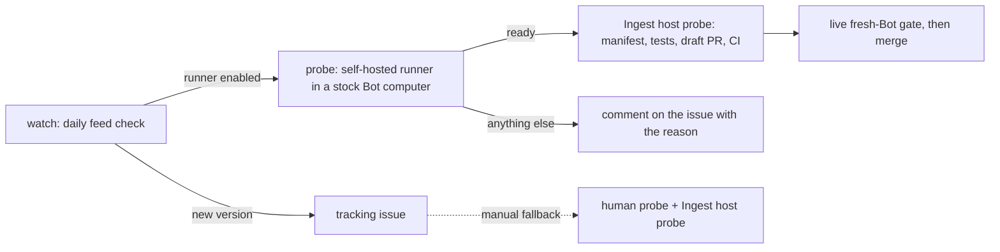

# Grok Bot version tracking

Grok Bot auto-updates; GrokRouter refuses any version without a manifest. This
pipeline closes that gap without ever loosening a gate. Detection and the
draft PR are automatic; support is claimed only after the live gate.



## Stage 1 — detection (automatic)

`.github/workflows/version-watch.yml` runs daily and polls the official stable
feed for Apple-silicon Macs:

```bash
python3 scripts/check-grokbot-version.py --check
```

Exit `2` means the feed reports a version with no file in `patch/manifests/`.
The workflow then opens (or reuses) a tracking issue with the probe
instructions below. It never edits a manifest and never claims support.

You can run the same check by hand at any time; without `--check` it just
prints the JSON report and exits `0`.

## Stage 2a — automatic probe (self-hosted Bot-computer runner)

The stock host lives only inside a Grok Bot computer
(`/home/box/sand-host/host-main.cjs`); the desktop DMG from the feed does not
contain it, so a GitHub-hosted runner cannot probe a new build. Instead a
GitHub Actions runner runs inside one dedicated Bot computer. When the feed
reports a new version, the `probe` job runs `scripts/auto-probe.py` there:

1. copies the live host to a scratch directory (the live file is only read);
2. runs `scripts/host-probe.py` on the copy;
3. accepts the build only if it has no router marker, its SHA-256 is not an
   already-shipped stock host, its version hints name the new version, the
   executor/session/session-options anchors and exactly one known
   mock-response dialect each appear exactly once, and its size sits in the
   newest manifest's band;
4. scaffolds the manifest in a scratch skeleton and proves
   install → restore on the copy with the real patcher (`node --check`
   included) returns the exact stock bytes.

Only the digest, byte count, version hints, and chosen anchors leave the Bot
computer — the same fields a shipped manifest records. Workflow logs of this
public repository are public, so the script prints only a status line. On
`ready` the `ingest` job calls **Ingest host probe** (Stage 2b) with that
sanitized probe and the draft PR opens by itself. Any other result is posted
once to the tracking issue and retried the next day:

| Status | Meaning and action |
| --- | --- |
| `box-not-updated` | The Bot computer still runs a shipped host. Open the new Grok Bot on the Mac that owns the runner's Bot so its computer moves to the new build. |
| `version-unconfirmed` | The host changed but does not name the feed version. Wait for the Bot computer to update; never force it. |
| `anchors-moved` | The build moved source lines. Use the manual path: pick replacement anchors from `candidates` and ingest by hand. The patcher may also need a code change for the new seam. |
| `patch-round-trip-failed` | The anchors count once but the real patch or restore failed on the copy. The adapter needs a code change for this build. |
| `size-outside-band` | Review the manifest size policy consciously; it is never auto-adjusted. |
| `not-stock` | GrokRouter or another router was installed on the runner's Bot computer. Restore stock Grok Bot there and never install GrokRouter on it. |
| `host-missing`, `probe-failed`, `scaffold-failed`, `probe-job-failed` | Runner or environment problem; see the workflow run. |

### Runner setup (one time)

1. In Grok Bot, create a Bot used only for this purpose and click
   **Open computer**. Never install GrokRouter on it and never store provider
   credentials there.
2. In GitHub: **Settings → Actions → Runners → New self-hosted runner**,
   choose Linux and the architecture `uname -m` reports in the Bot terminal,
   and follow the download commands there. Configure it with the label the
   workflow targets:

   ```bash
   ./config.sh --url https://github.com/swcstudiospace/grokrouter \
     --token <registration token> --name grokbot-box --labels grokbot-box --unattended
   ./run.sh
   ```

   Keep `run.sh` running (for example in `tmux`). A Bot computer that sleeps
   leaves the job queued; the next daily run replaces a queued one.
3. Set the repository variable `GROKBOT_PROBE_RUNNER` to `true`
   (**Settings → Secrets and variables → Actions → Variables**). Until it is
   set the `probe` job is skipped and only the tracking issue is opened.
4. Keep the Mac's Grok Bot updating so the Bot computer follows the feed.

This is a public repository. GitHub's
[secure-use reference](https://docs.github.com/en/actions/reference/security/secure-use)
says self-hosted runners should almost never serve public repositories,
because a pull request can add a workflow that targets the runner label. The
runner is therefore confined to a throwaway Bot computer holding no
credentials, and **Settings → Actions → General → Approval for running fork
pull request workflows from contributors** must be set to
**Require approval for all external contributors** before the runner is
registered (the API value is `all_external_contributors` on
`repos/{owner}/{repo}/actions/permissions/fork-pr-contributor-approval`).
Review any PR that touches `.github/workflows/` before approving its run. The
`probe` job itself has read-only repository permissions; the draft PR is
opened by a GitHub-hosted job.

## Stage 2b — scaffold from a probe (automatic caller or manual fallback)

Without the runner, or when the automatic probe reports `anchors-moved`, a
human with the new Grok Bot on a Mac selects any Bot, clicks
**Open computer**, and runs the read-only probe in the Bot terminal:

```bash
python3 scripts/host-probe.py \
  --anchor 'function createMockPromptExecutor(options2)' \
  --anchor 'createSession(onRequestId, sessionOptions)' \
  --anchor 'const mainSessionOptions = {' > /tmp/probe.txt
```

If an anchor counts anything other than exactly once, use the probe's
`candidates` lines to pick the replacement source line for the new build,
re-run with `--anchor '<exact line>'` for it, and confirm every chosen anchor
counts exactly once with an empty `candidates.routerMarker` (a non-empty
marker means the host is not stock — stop).

A maintainer can paste the complete probe output into the **Ingest host probe**
workflow (dispatch inputs: `version`, `probe_json`, one reviewed anchor per line
in `anchors`, optionally `tracking_issue`), or run the same script locally:

```bash
python3 scripts/new-manifest-from-probe.py \
  --version <new version> --probe /tmp/probe.txt --anchor '<anchor>' ...
```

The script validates the probe (stock host, digest shape, size inside the
shipped policy band, version hint agreement, every anchor exactly once) and
then writes `patch/manifests/<version>.json` plus the installer version-list
updates (`GrokBotRouterInstaller.swift`, `install-macos.sh`,
`remote/install.sh`). It refuses to overwrite an existing manifest, refuses a
non-stock host, and reloads the written manifest through the same
`router_patch.load_manifest` gates as the shipped ones. The workflow runs the
patch tests, opens a **draft** PR with the do-not-merge checklist, and
dispatches CI on the branch (a PR opened with `GITHUB_TOKEN` fires no
`pull_request` workflows). The automatic path calls this same workflow.

## Stage 3 — proof (manual, required)

Nothing is supported until a human completes, on the new version:

1. `npm test`.
2. The full fresh-Bot procedure in `docs/FRESH-BOT-ACCEPTANCE.md`
   (install → restore → reinstall → new Bot → `/router doctor` →
   `/provider` → one normal turn).
3. A `docs/TEST-MATRIX.md` row with the visible result and redacted audit
   receipt — code inspection alone never flips a row to Pass.
4. The README supported-version badge/message, only after the above pass.

## Design rules

- Detection, probing, and scaffolding are automatic; trust is not. No workflow
  merges, tags, or edits a manifest from anything but a live probe.
- Anchor strings are never invented. The automatic probe only reuses anchors
  the patcher already hooks and only when each counts exactly once; a version
  with moved source lines needs a new reviewed anchor set from probe
  candidates, not a reused old one.
- Size-band or policy changes are conscious edits, never auto-adjusted: the
  ingest fails outside the shipped band so a human reviews it.
