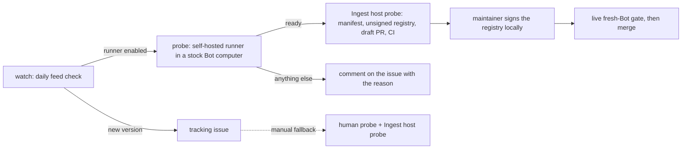

# Grok Bot version tracking

Grok Bot auto-updates. Two support tracks exist:

- **Grok Bot 0.63.0 and newer: delegation mode.** The floor is
  `delegation.minimumVersion` in `compatibility/supported-apps.json`; each
  release that passes the live check is added to `delegation.verifiedVersions`.
  Delegation mode never reads or patches the host, so a new version needs no
  probe, manifest, or registry: the daily watch opens a "needs a delegation-mode
  live check" issue (`scripts/check-grokbot-version.py --check` exits `3`) and
  [DELEGATION-MODE.md](DELEGATION-MODE.md#when-grok-bot-updates) has the
  checklist. Every stage below this list belongs to the other track.
- **Grok Bot 0.30.0–0.44.0: the host adapter (deprecated).** Kept for those
  versions only; no newer version will be added to it.

For the adapter, GrokRouter treats every desktop version as a separate
gate: a version listed in `compatibility/supported-apps.json` has its own
manifest in `patch/manifests/` and its own signed host registry in
`compatibility/`. Anything else is refused unless the user turns on the
[experimental unreviewed-version opt-in](#interim-the-unreviewed-version-opt-in).
This pipeline closes the gap without ever loosening a gate. Detection and the
draft PR are automatic; signing is a local maintainer step; support is claimed
only after the live gate.



## When every anchor counts once and nothing routes

Anchor counts prove the patch can be applied, not that Grok still executes
the patched code. Grok Bot 0.63.0 is the first build where the two diverge:
the probe reports every manifest anchor and all three patch seams exactly
once, the patcher installs and `node --check` passes, the watchdog keeps the
host repaired, and `/provider` even prints the router's stored state — yet no
turn is routed. On a live 0.63.0 Bot computer (2026-09-30) the patched
`createSession(onRequestId, sessionOptions)` was never entered across
several chat turns and host restarts, while the same host answered every
turn with stock inference and ran the router's skills as ordinary skills.
The bundles shipped next to the host (`sand-eval-runner.cjs`,
`/exec-daemon/index.js`) do not start during a turn, and the desktop app's
`app.asar` carries no turn loop, so on 0.62.0+ chat inference is no longer
performed by the Bot computer's host at all. This is why the adapter track
ends at 0.44.0: 0.63.0 and newer are served by
[delegation mode](DELEGATION-MODE.md), which never touches the host. The
opt-in still installs cleanly on those builds and routes nothing there; do
not use it on 0.62.0+.

Two tools make this visible instead of silent:

- The host hook now writes a redacted `seam_hit` audit event every time the
  patched `createSession` runs. `grokbot-router doctor` (and
  `node run-provider.mjs --seam-status`) report the last chat and
  maintenance session that reached the seam and the last routed turn. A
  fresh install that never shows a seam hit after a chat turn has no seam on
  the path, whatever the anchor counts say.
- `scripts/host-probe.py` reports `turnLoopAnchors` for the host and for
  each bundle next to it (`--bundle` adds more), lists which node processes
  run which bundle, and `--watch SECONDS` records every process that starts
  while you send the Bot one chat message. Run it on a Bot computer whose
  host is stock, send the Bot a plain message during the watch window, and
  read the `bundles`, `processes` and `watch` sections before choosing a seam
  for a new build.

## Stage 1 — detection (automatic)

`.github/workflows/version-watch.yml` runs daily and polls the official stable
feed for Apple-silicon Macs:

```bash
python3 scripts/check-grokbot-version.py --check
```

Exit `2` means the feed reports a version with no file in `patch/manifests/`
(every reviewed version has one). The workflow then opens (or reuses) a
tracking issue with the probe instructions below. It never edits a manifest
and never claims support.

You can run the same check by hand at any time; without `--check` it just
prints the JSON report and exits `0`.

## Stage 2a — automatic probe (self-hosted Bot-computer runner)

The stock host lives only inside a Grok Bot computer
(`/home/box/sand-host/host-main.cjs`). The desktop download does not contain
it: unpacking the 0.61.0 DMG shows no host anchors in `app.asar`. A
GitHub-hosted runner therefore cannot probe a new build. Instead a
GitHub Actions runner runs inside one dedicated Bot computer. When the feed
reports a new version, the `probe` job runs `scripts/auto-probe.py` there:

1. copies the live host to a scratch directory (the live file is only read);
2. runs `scripts/host-probe.py` on the copy;
3. accepts the build only if it has no router marker, its SHA-256 is not an
   already-shipped stock host, its version hints name the new version, the
   executor/session/session-options anchors and exactly one known
   mock-response dialect each appear exactly once, the three patch seams
   (group member dispatch, memory-extraction executor, episode-summary
   executor) each appear exactly once, and its size sits in the newest
   manifest's band;
4. scaffolds the manifest in a scratch skeleton and proves
   install → restore on the copy with the real patcher (`node --check`
   included) returns the exact stock bytes.

Only the digest, byte count, version hints, and chosen anchors leave the Bot
computer — the same fields a shipped manifest records. Workflow logs of this
public repository are public, so the script prints only a status line. On
`ready` the `ingest` job calls **Ingest host probe** (Stage 2b) with that
sanitized probe and the draft PR opens by itself. Any other result is posted
once to the tracking issue and retried the next day:

| Status | Meaning and action |
| --- | --- |
| `box-not-updated` | The Bot computer still runs a shipped host. Open the new Grok Bot on the Mac that owns the runner's Bot so its computer moves to the new build. |
| `version-unconfirmed` | The host changed but does not name the feed version. Wait for the Bot computer to update; never force it. |
| `anchors-moved` | The build moved source lines. Use the manual path: pick replacement anchors from `candidates` and ingest by hand. The patcher may also need a code change for the new seam. |
| `patch-round-trip-failed` | The anchors count once but the real patch or restore failed on the copy. The adapter needs a code change for this build. |
| `size-outside-band` | Review the manifest size policy consciously; it is never auto-adjusted. |
| `not-stock` | GrokRouter or another router was installed on the runner's Bot computer. Restore stock Grok Bot there and never install GrokRouter on it. |
| `host-missing`, `probe-failed`, `scaffold-failed`, `probe-job-failed` | Runner or environment problem; see the workflow run. |

### Runner setup (one time)

1. In Grok Bot, create a Bot used only for this purpose and click
   **Open computer**. Never install GrokRouter on it and never store provider
   credentials there.
2. In GitHub: **Settings → Actions → Runners → New self-hosted runner**,
   choose Linux and the architecture `uname -m` reports in the Bot terminal,
   and follow the download commands there. Configure it with the label the
   workflow targets:

   ```bash
   ./config.sh --url https://github.com/swcstudiospace/grokrouter \
     --token <registration token> --name grokbot-box --labels grokbot-box --unattended
   ./run.sh
   ```

   Keep `run.sh` running (for example in `tmux`). A Bot computer that sleeps
   leaves the job queued; the next daily run replaces a queued one.
3. Set the repository variable `GROKBOT_PROBE_RUNNER` to `true`
   (**Settings → Secrets and variables → Actions → Variables**). Until it is
   set the `probe` job is skipped and only the tracking issue is opened.
4. Keep the Mac's Grok Bot updating so the Bot computer follows the feed.

This is a public repository. GitHub's
[secure-use reference](https://docs.github.com/en/actions/reference/security/secure-use)
says self-hosted runners should almost never serve public repositories,
because a pull request can add a workflow that targets the runner label. The
runner is therefore confined to a throwaway Bot computer holding no
credentials, and **Settings → Actions → General → Approval for running fork
pull request workflows from contributors** must be set to
**Require approval for all external contributors** before the runner is
registered (the API value is `all_external_contributors` on
`repos/{owner}/{repo}/actions/permissions/fork-pr-contributor-approval`).
Review any PR that touches `.github/workflows/` before approving its run. The
`probe` job itself has read-only repository permissions; the draft PR is
opened by a GitHub-hosted job.

## Stage 2b — scaffold from a probe (automatic caller or manual fallback)

Without the runner, or when the automatic probe reports `anchors-moved`, a
human with the new Grok Bot on a Mac selects any Bot, clicks
**Open computer**, and runs the read-only probe in the Bot terminal:

```bash
python3 scripts/host-probe.py \
  --anchor 'function createMockPromptExecutor(options2)' \
  --anchor 'createSession(onRequestId, sessionOptions)' \
  --anchor 'const mainSessionOptions = {' > /tmp/probe.txt
```

The probe always reports `patchAnchors`, the three seams the patch hooks in
every version (`const memberResult = await runner.run(promptForAttempt, {`,
`const extraction = await extractMemories({`,
`const narrative = await summarizeEpisode({`). Each must count exactly once;
a moved seam means the patcher needs a code change, not just new anchors.

If a manifest anchor counts anything other than exactly once, use the probe's
`candidates` lines to pick the replacement source line for the new build,
re-run with `--anchor '<exact line>'` for it, and confirm every chosen anchor
counts exactly once with an empty `candidates.routerMarker` (a non-empty
marker means the host is not stock — stop). The mock-response line differs by
version: 0.30.0 and 0.36.0 read `process.env.SAND_AGENT_MOCK_RESPONSE`, 0.44.0
reads `options2.agentMockResponse`; the probe counts both.

A maintainer can paste the complete probe output into the **Ingest host probe**
workflow (dispatch inputs: `version`, `probe_json`, one reviewed anchor per line
in `anchors`, optionally `tracking_issue`), or run the same script locally:

```bash
python3 scripts/new-manifest-from-probe.py \
  --version <new version> --probe /tmp/probe.txt --anchor '<anchor>' ...
```

The script validates the probe (stock host, digest shape, size inside the
newest manifest's band, version hint agreement, every anchor and every patch
seam exactly once) and then writes the beta.47 per-version layout:

- `patch/manifests/<version>.json` with `anchorVerifiedHosts.enabled` set to
  `false` (the size band is kept only to bound a later unreviewed version);
- the version added to `compatibility/supported-apps.json`;
- an **unsigned** `compatibility/<version>-hosts.json`;
- the version literals in `installer/GrokBotRouterInstaller.swift` and
  `installer-windows/main.cjs`.

It refuses to overwrite an existing manifest or registry, refuses a non-stock
host, prepares every edit before writing so a missing literal changes nothing,
and reloads the written manifest through the same `router_patch.load_manifest`
gates as the shipped ones. The workflow opens a **draft** PR with the
do-not-merge checklist and dispatches CI on the branch (a PR opened with
`GITHUB_TOKEN` fires no `pull_request` workflows). The automatic path calls
this same workflow. CI never holds the signing key, so the draft cannot pass
registry verification until a maintainer signs it.

## Stage 2c — sign the registry (maintainer, local)

On the maintainer's machine, check out the draft branch and run:

```bash
node scripts/sign-host-registry.mjs compatibility/<version>-hosts.json
```

The private key is this fork's Ed25519 registry key at
`~/.config/grokrouter/release/host-registry-private.pem` (override the path with
`GROKROUTER_HOST_REGISTRY_PRIVATE_KEY`). It never enters the repository, CI, or
a log. Its public half is `compatibility/registry-public-key.pem`; upstream's
signatures are not trusted by this fork. Commit
`compatibility/<version>-hosts.json.sig` with the registry. Installed routers
refresh registries from
`https://raw.githubusercontent.com/swcstudiospace/grokrouter/main/compatibility/`.

## Stage 3 — proof (manual, required)

Nothing is supported until a human completes, on the new version:

1. `npm test` with the signed registry.
2. The full fresh-Bot procedure in `docs/FRESH-BOT-ACCEPTANCE.md`
   (install → restore → reinstall → new Bot → `/router doctor` →
   `/provider` → one normal turn, plus the capability proof).
3. A `docs/TEST-MATRIX.md` row with the visible result and redacted audit
   receipt — code inspection alone never flips a row to Pass.
4. The README compatibility table and badge, only after the above pass.

A manifest in the repository without that live pass is a reviewed host, not a
supported version. 0.44.0 is in that state: its host hash is from a live probe,
but the three beta.47 patch seams have not been proven on a live 0.44.0 probe
and no fresh-Bot acceptance has run.

## Interim: the unreviewed-version opt-in

Until a new version passes Stage 3, users can check **Allow unreviewed Grok Bot
version (experimental)** in either installer. It is off by default and applies
only to a version strictly newer than every version in
`compatibility/supported-apps.json`. Older and in-between versions are always
refused, and a reviewed version never uses this path.

With the opt-in, `remote/install.sh --allow-unreviewed-version` picks the
newest reviewed manifest whose anchors all appear exactly once on the live host
and accepts the host only by structural verification: no router marker, every
required anchor and patch seam exactly once, a read-only patch that passes
`node --check`, and a size inside that manifest's band. It backs up the
untouched host, and Doctor reports `HOSTTRUST=UNREVIEWED-ANCHOR-VERIFIED` plus
an `UNREVIEWED VERSION` line. No signed registry exists for an unreviewed
version, so the watchdog never refreshes one.

If the build moved an anchor or seam, installation stops before changing
anything and prints a compatibility report including `PATCHANCHORS=` and
`PATCHDRYRUN=`. Treat that report as the trigger for Stage 2b. Structural
checks cannot prove the backup is genuine stock, which is why the opt-in is
never a substitute for a reviewed manifest.

## Design rules

- Detection, probing, and scaffolding are automatic; trust is not. No workflow
  merges, tags, signs, or edits a manifest from anything but a live probe.
- Anchor strings are never invented. The automatic probe only reuses anchors
  the patcher already hooks and only when each counts exactly once; a version
  with moved source lines needs a new reviewed anchor set from probe
  candidates, not a reused old one.
- Size-band or policy changes are conscious edits, never auto-adjusted: the
  ingest fails outside the shipped band so a human reviews it.
- The unreviewed opt-in stays off by default and never widens to reviewed,
  older, or in-between versions.
